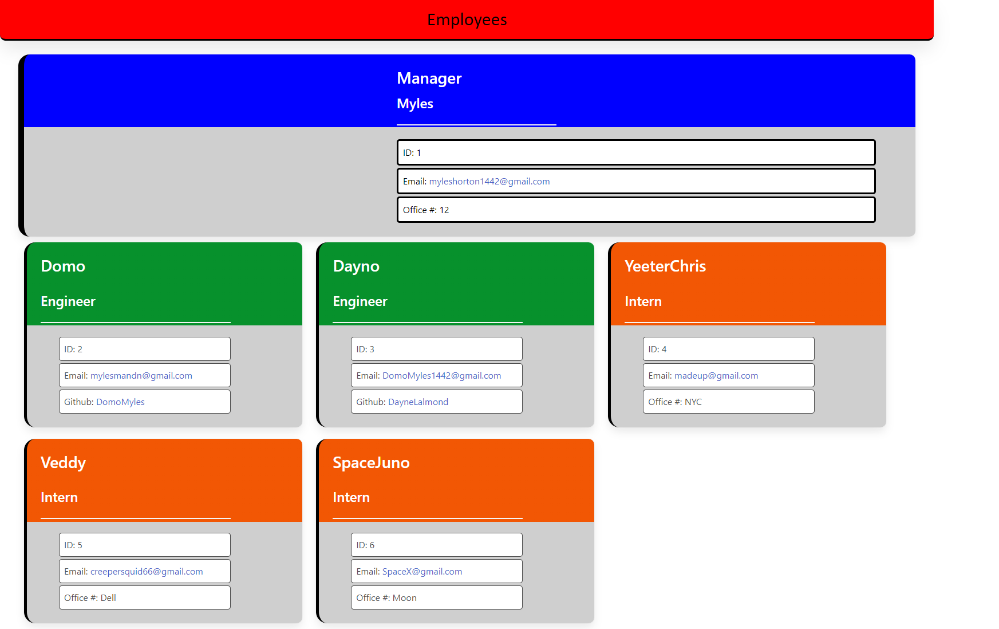

Your Workers.

Motovation.
I wanted to create this project to have a sort of organization between workers of a company.

Functionality:
This application will allow you to create a business worker layout in a way where you have the manager and you can set associates of two ranks: Engineer and Intern. They will be displayed with their Employee id and contact information.
This would be great use in a small business environment.
 
Usage:
In the terminal you type node index.js.
You will now be prompted with questions about the manager position, after answering them you will be given options to add an engineer or intern and be prompted with similar questions related to their position. You can add as many of either one as you want. When you are finished adding your employees click Finish. A html page will then be created for you to launch and view at you will.

 One fun thing I learned is that you can create a whole website based off of input from a terminal off of vs code input.

Screenshot:

Video:
[(https://youtu.be/Bc4CGDOSGrE)]